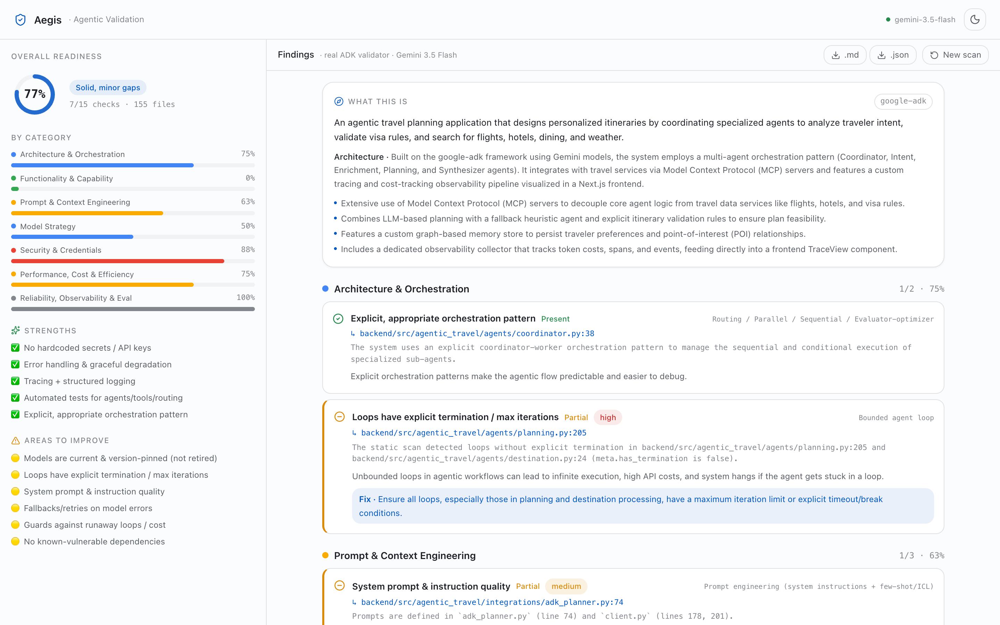
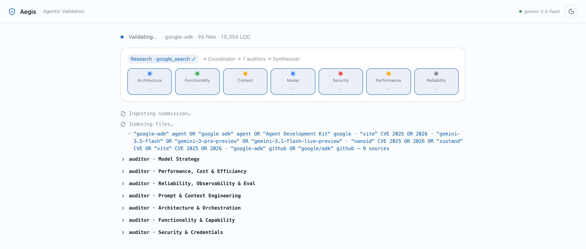
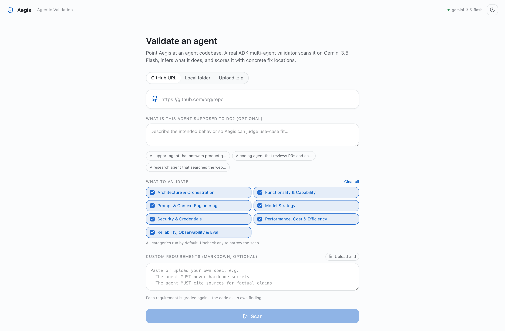

<div align="center">


# Aegis — Agentic Validation

**Point it at an AI-agent codebase. A real multi-agent validator reads the code, figures out what it does, and grades it — every finding pinned to a `path:line`, with a concrete fix.**

[](https://github.com/vmishra/Agentic-Validation/actions/workflows/ci.yml)
[](LICENSE)


[](CONTRIBUTING.md)

Aegis ingests an agent project (**GitHub URL, local folder, or `.zip`**), runs a **Google ADK multi-agent system** on **Gemini 3.5 Flash**, and returns a categorized readiness report: architecture, functionality, prompt/context engineering, model strategy, security, performance, and reliability.



</div>

---

<details>
<summary><b>Table of contents</b></summary>

- [Why Aegis](#why-aegis)
- [What you get](#what-you-get)
- [How it works](#how-it-works)
- [Validation categories](#validation-categories)
- [Quick start](#quick-start)
- [Configuration](#configuration)
- [Deploy to Cloud Run](#deploy-to-cloud-run)
- [Development](#development)
- [Continuous integration](#continuous-integration)
- [Security & privacy](#security--privacy)
- [Roadmap](#roadmap)
- [Contributing](#contributing)
- [License](#license)

</details>

## Why Aegis

Teams are shipping agents fast, but *"is this a **well-built** agent?"* is hard to answer at scale. Aegis makes it a one-click scan. It's framework-agnostic (detects 18+ agent stacks), grounded in current best practices (it does live web research during a scan), and it will validate against **your own requirements** too — paste a Markdown spec and each requirement becomes a graded check.

The validator is itself a clean ADK multi-agent system, so it doubles as a reference example of the patterns it checks for.

## What you get

- **Three inputs** — GitHub URL · local folder · `.zip` upload.
- **Purpose & architecture extraction** — Aegis first tells you what the app *is*, inferred from the code.
- **7 validation categories, ~36 checks** — each finding has a status, severity, evidence, **the exact `path:line` to fix**, a concrete recommendation, and web citations where relevant.
- **Bring your own spec** — upload/paste a `.md` requirements doc; each requirement is graded against the code.
- **Pick what to validate** — all categories on by default; uncheck to narrow the scan.
- **Live run** — watch the agent graph light up and findings stream in.
- **Scorecard + export** — overall readiness band, per-category scores, strengths/gaps; export to Markdown or JSON.
- **Scan history** — past scans persist to disk; click to reopen.

## How it works

```
  Ingest (zip · folder · GitHub)
        └─► sandboxed workspace
               │
   ┌───────────▼─────────────┐   deterministic, no LLM
   │ Indexer                 │   → framework + signals (tools, sub-agents,
   │  builds a bounded        │     loops, models, prompts, secrets, deps…)
   │  "evidence pack"         │     each with path:line + excerpt
   └───────────┬─────────────┘
               │  evidence + use-case + your spec
   ┌───────────▼──────────────────── Google ADK · gemini-3.5-flash ──────────┐
   │ Coordinator (SequentialAgent)                                            │
   │   1. Overview      — infers purpose / architecture / nuances             │
   │   2. Research      — google_search: model currency, CVEs, best practices │
   │   3. ParallelAgent — one auditor per selected category (+ your spec)     │
   │   4. Synthesizer   — summary, use-case fit, relevance                    │
   └───────────┬──────────────────────────────────────────────────────────────┘
               │  streamed events (SSE)              scoring is deterministic
   ┌───────────▼─────────────┐                       (Python, not the LLM)
   │ React portal (Vite)      │  live agent graph · scorecard · findings · export
   └─────────────────────────┘
```

Watch it run — the coordinator fans out to one auditor per category, in parallel, each grounded by a live `google_search`:

<div align="center">

</div>

Design choices that make it robust at scale: each auditor reasons over a **bounded evidence pack in a single call** (input size is constant regardless of repo size), every model call **retries transient errors with exponential backoff**, and a single failing category **degrades to a partial report** instead of aborting the scan. See [`docs/ARCHITECTURE.md`](docs/ARCHITECTURE.md).

## Validation categories

| Category | What it looks for (examples) |
|----------|------------------------------|
| **Architecture & Orchestration** | multi-agent decomposition · routing/parallel/loop patterns · **bounded loops** · state handoff · reusable skills |
| **Functionality & Capability** | tool choice & typed schemas · structured outputs · grounding/RAG when needed · **use-case coverage** |
| **Prompt & Context Engineering** | system-prompt/instruction quality · context-window management · memory scoping · token discipline |
| **Model Strategy** | right model per task · **model currency** (checked live) · generation params · fallbacks |
| **Security & Credentials** | **no hardcoded secrets** · prompt-injection defense (LLM01) · excessive agency (LLM06) · PII handling · dependency CVEs |
| **Performance, Cost & Efficiency** | parallelization · caching · streaming · runaway-cost guards |
| **Reliability, Observability & Eval** | error handling · idempotent writes · tracing/logging · tests · evals & negative tests |
| **Custom Requirements** *(when you provide a spec)* | each requirement in your `.md` graded present / partial / missing |

## Quick start

Aegis runs **entirely on your own machine** — one script starts the backend API and the web UI together. From clone to first scan takes about a minute.

**Prerequisites**
- **Python 3.10+**
- **Node.js 18+** and npm
- **git** (to clone this repo and to scan GitHub URLs)
- A **Google AI Studio API key** — free at <https://aistudio.google.com/apikey>

### 1 · Clone the repo
```bash
git clone https://github.com/vmishra/Agentic-Validation.git
cd Agentic-Validation
```
Run every command below from this project folder.

### 2 · Add your Gemini key
Copy the template to create your local env file:
```bash
cp .env.example .env
```
Then open **`.env`** (in the project root) and set the one required value:
```ini
GEMINI_API_KEY=your_key_here
```
`.env` is git-ignored — your key stays on your machine and is never committed. (Grab a free key at <https://aistudio.google.com/apikey>.)

### 3 · Start it
```bash
./app.sh start
```
The first run creates a Python virtualenv, installs the backend + frontend dependencies, and launches both servers. When it prints `✓ Aegis up`, open:

👉 **http://localhost:5176**

Manage the servers anytime (from the project root):
```bash
./app.sh status    # is it running?
./app.sh logs      # tail the combined backend + frontend log
./app.sh restart   # restart both
./app.sh stop      # stop both
```

### 4 · Run a scan
In the browser:

1. **Choose a source** — a **GitHub URL**, a **local folder** path, or **upload a `.zip`**.
2. *(optional)* **Describe the use case** so Aegis can judge how well the agent fits its purpose.
3. *(optional)* **Add a requirements spec** (`.md`) — each requirement becomes its own graded check.
4. **Pick categories** (all on by default), then click **Scan**.
5. Watch the **agent graph** run live, then read the **scorecard + findings** — every finding has a `path:line` and a concrete fix. Export to **Markdown** or **JSON**, and reopen past scans from **Recent scans**.

<div align="center">

</div>

> **No key yet?** The app still starts and runs the deterministic static index (framework + signals). Add `GEMINI_API_KEY` to `.env`, run `./app.sh restart`, and you get the full agentic validation.

## Configuration

Set in `.env` (loaded by the backend):

| Variable | Default | Description |
|----------|---------|-------------|
| `GEMINI_API_KEY` | — | **Required.** Google AI Studio key. |
| `GOOGLE_GENAI_USE_VERTEXAI` | `false` | Keep `false` to use the AI Studio (Developer API) path. |
| `AEGIS_MODEL` | `gemini-3.5-flash` | Model for every validator agent. |
| `AEGIS_RUN_TIMEOUT` | `300` | Per-scan wall-clock backstop (seconds). |
| `AEGIS_HISTORY_DIR` | `./.aegis-history` | Where completed reports are stored. |

Ports are set on the shell (read by `app.sh` and Vite):
```bash
AEGIS_FE_PORT=3000 AEGIS_BE_PORT=9000 ./app.sh start
```

## Deploy to Cloud Run

Ship Aegis as an internal web app protected by **Identity-Aware Proxy** — only your
Google Workspace domain (e.g. `@your-company.com`) can sign in. One command:

```bash
gcloud config set project YOUR_PROJECT
AEGIS_ALLOWED_DOMAIN=your-company.com ./deploy.sh
```

It builds a container (frontend + backend in one image), deploys to Cloud Run with IAP,
stores your key in **Secret Manager**, and restricts access to your Google Workspace
domain — no load balancer needed. Local-folder scanning is auto-disabled in the cloud
(users scan via GitHub URL or `.zip`). Full guide, options, and teardown: **[`docs/DEPLOY.md`](docs/DEPLOY.md)**.

## Development

```bash
# Backend tests (deterministic; live ADK tests self-skip without a key)
cd backend && ../.venv/bin/python -m pytest -q

# Frontend tests + typecheck + production build
npm run test
npm run typecheck
npm run build
```

Project layout:
```
backend/        FastAPI + Google ADK validator
  server.py       API + SSE streaming + report persistence
  ingest.py       zip / folder / GitHub → sandboxed workspace (safety-checked)
  indexer.py      deterministic evidence pack (+ bounded view for prompts)
  detectors.py    framework + signal detection
  rubric.py       categories + checks
  scoring.py      deterministic scoring + report assembly
  agents/         overview · research · auditors · synthesizer · coordinator
src/            React + Vite portal (source → scanning → report)
docs/           ARCHITECTURE.md · DEPLOY.md · assets/
app.sh          one-command start/stop
```

## Continuous integration

GitHub Actions runs on every push/PR — backend `pytest` plus frontend typecheck/test/build
([`.github/workflows/ci.yml`](.github/workflows/ci.yml)). An opt-in workflow deploys to
Cloud Run on a `v*` tag ([`.github/workflows/deploy.yml`](.github/workflows/deploy.yml); see
[`docs/DEPLOY.md`](docs/DEPLOY.md)).

## Security & privacy

- **Your key stays local.** It lives in `.env` (git-ignored) and is used only to call the Gemini API from your machine.
- **Secrets are masked.** If a scanned repo contains hardcoded secrets, they're redacted before appearing in evidence, logs, or reports.
- **Sandboxed ingest.** Uploads/clones are extracted into a temp workspace with zip-slip / path-traversal protection; the workspace is deleted after each scan.
- **Reports persist locally** under `.aegis-history/` (git-ignored). Delete the folder to clear history.
- Found a vulnerability? Please open a private report rather than a public issue.

## Roadmap

- Optional prebuilt scanners (detect-secrets, pip-audit/npm-audit, tree-sitter) for even stronger deterministic checks
- PDF export and shareable report links
- CI integration (a GitHub Action) to gate PRs
- Vertex AI auth path

## Contributing

Contributions welcome — see [`CONTRIBUTING.md`](CONTRIBUTING.md).

## License

[Apache-2.0](LICENSE) © 2026 Vikas Mishra
